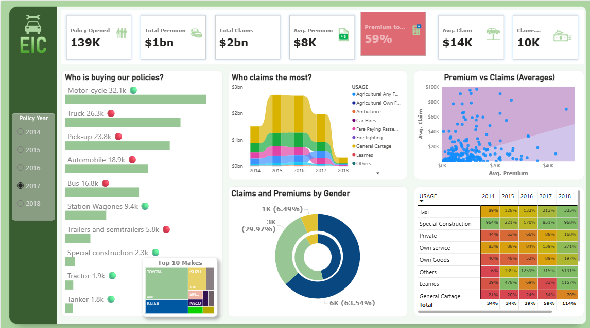

# 🚗 EIC Insurance Dashboard

An interactive data visualization project created to analyze and understand the financial struggles of **EIC**, a vehicle insurance company. This report explores **policy trends**, **premium vs claim dynamics**, **customer demographics**, and **vehicle usage insights** over a 5-year period (2014–2018).

---

## 📊 Project Overview

This Power BI dashboard aims to uncover the root causes behind the economic downturn faced by EIC. Through interactive visuals and aggregated KPIs, stakeholders can quickly grasp how premiums, claims, customer behavior, and vehicle categories have evolved — and where losses may have stemmed from.

---

## 📌 Key Insights

- **Negative Profitability**: Total claims ($2B) significantly exceed total premiums ($1B) — a **59% claims-to-premium** ratio.
- **High-Risk Segments**:
  - **General Cartage**, **Taxi**, and **Learners** show the most claim volume relative to premiums.
  - Claims are heavily concentrated in certain years (peaking between 2015–2017).
- **Gender Breakdown**:
  - Males account for the majority (63%) of claims and premiums.
- **Vehicle Types**:
  - Motorcycles, trucks, and pickups form the largest policyholder base.
- **Premium vs Claim Imbalance**:
  - Many data points show claims exceeding premiums, suggesting poor risk assessment or underpricing in policies.

---

## 📂 Project Features

- **KPI Cards**: Key metrics like total premiums, average claim, average premium, and policy count and many more.
- **Trend Analysis**: Claims over time by vehicle usage category.
- **Demographic Analysis**: Claims and premiums segmented by gender.
- **Scatter Analysis**: Visual comparison of average premiums vs claims.
- **Heatmap**: Year-over-year growth or decline in performance by vehicle usage.
- **Treemap**: Top 10 vehicle makes in policy volume.

---

## 🛠️ Tools Used

The dashboard was built using the following tools and technologies: 
•	📊 Power BI Desktop – Main data visualization platform used for report creation. 
•	📂 Power Query – Data transformation and cleaning layer for reshaping and preparing the data. 
•	🧠 DAX (Data Analysis Expressions) – Used for calculated measures, dynamic visuals, and conditional logic. 
•	📝 Data Modeling – Relationships established among tables to enable cross-filtering and aggregation. 
•	📁 File Format – .pbix for development and .png for dashboard previews.

---

## 📁 Data Source

- [🔗 Click here to access the dataset](https://data.mendeley.com/datasets/34nfrk36dt/1)

---

## 🖼️ Project Demo

### 📌 Dashboard Main Page

  
*Interactive Power BI report exploring EIC’s insurance metrics and claims performance.*

---

## 🚀 How to Use

1. Open the `.pbix` file in Power BI Desktop.
2. Use the slicers (e.g., Policy Year) to explore year-specific insights.
3. Hover over visual elements for tooltips with detailed metrics.
4. Click on legends to isolate specific vehicle types or demographics.

---

## 📈 Business Questions Answered

- Who are the most frequent policy buyers and claimants?
- Which vehicle usage types are financially draining?
- Is pricing aligned with risk?
- How have premiums and claims changed over time?
- Are there demographic patterns in claim frequency?

---

## 📉 Conclusion

This report serves as a diagnostic tool for EIC’s leadership to realign its underwriting strategy, pricing model, and risk management policies. The overexposure to high-claim segments with underpriced premiums was likely a key contributor to its financial decline.

---

## 📬 Feedback

Feel free to open issues or submit pull requests for suggestions and improvements!

